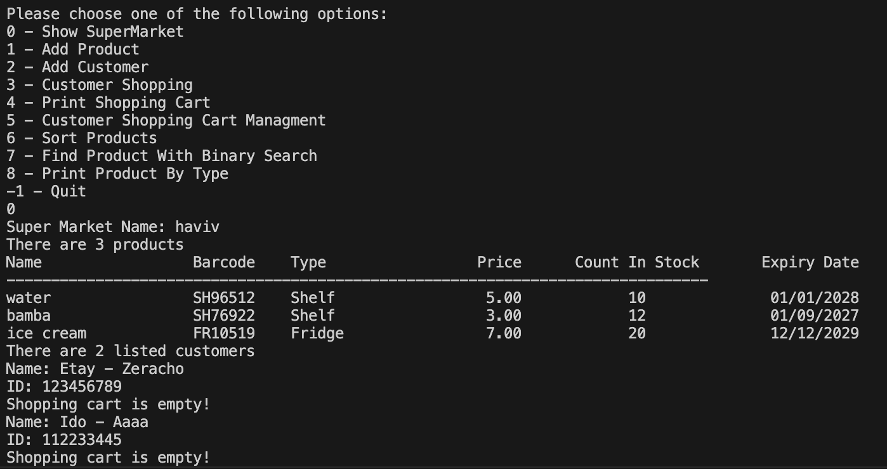

# 🛒 SuperMarket Management System

Welcome to the **SuperMarket Management System**, a comprehensive C-based project simulating a supermarket environment. The system allows management of customers, products, shopping carts, purchases, and more, while emphasizing dynamic memory management, robust input validation, and advanced data structures.

---

## 📚 Project Overview

The SuperMarket system provides a **complete management solution**, including:

- 👥 **Customer & ClubMember Management**
  - Add and manage customers with unique IDs and names
  - Club members receive tiered discounts based on membership duration
- 🛍️ **Product Management**
  - Add new products or update existing stock
  - Sort products by name, stock, or price
  - Efficient searching using binary search (`bsearch`)
- 🛒 **Shopping Cart Operations**
  - Add items with quantity validation
  - Print cart contents and total price
  - Complete purchases or cancel them, automatically updating stock
  - Linked lists for dynamic cart management
- ⚡ **Advanced C Concepts**
  - Function pointers for generic operations
  - Polymorphism and inheritance via `ClubMember`
  - Dynamic memory allocation with proper management
- ✅ **Robust Input Validation**
  - Validates customer IDs, product barcodes, quantities, prices, and dates

---

## 🖼️ Program Demo

## ⚙️ How to Run

This repository includes two parts of the **SuperMarket Management System** project.  

- **Part 1:** Implements the core supermarket functionality, including customer and product management, shopping carts, and basic purchase operations.  
  Refer to the `README` in the **part1** folder for detailed instructions on how to compile and run this part.

- **Part 2:** Extends Part 1 with advanced features such as linked lists, file persistence, club member discounts, sorting, and searching.  
  Refer to the `README` in the **part2** folder for detailed instructions on how to compile and run this part.

💡 **Note:** It is recommended to run Part 1 first to understand the core functionality before exploring the extended features in Part 2.

